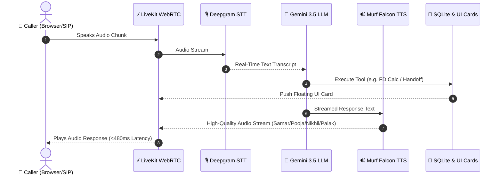

# Building Jan Dhan Seva: A Multi-Agent Voice AI Assistant for Financial Literacy in India 🇮🇳

> **#10DaysOfAIVoiceAgents Challenge — VoiceForBharat Edition by Murf AI**  
> *Powered by Murf Falcon TTS, LiveKit Agents SDK, Deepgram STT, Google Gemini LLM, Next.js 15, and SQLite.*


---

## 📌 1. The Problem & The Audience

In India, hundreds of millions of citizens are entering the formal banking system through national financial inclusion initiatives like the **Pradhan Mantri Jan Dhan Yojana (PMJDY)**. However, a major barrier remains: **financial literacy and language accessibility**.

Navigating complex banking terminology, understanding government scheme eligibility, calculating fixed deposit (FD) returns, or avoiding cyber fraud can be daunting—especially for first-time banking users who prefer communicating in their native language over text or voice.

To solve this, I built **Jan Dhan Seva (Aarav Voice Agent)**—an interactive, register-aware, multilingual AI voice assistant designed to deliver accessible financial guidance in **Hindi (Devanagari)** and **English**.

---

## 🏗️ 2. How the System Works

The system operates on an ultra-low latency (<480ms voice turn) streaming loop using WebRTC transport.




### Core Architecture Components:
1. **Streaming Speech-to-Text (STT)**: Deepgram `nova-3` for real-time multilingual speech recognition (Hindi + English).
2. **Brain / Reasoning Engine (LLM)**: Google `gemini-3.5-flash-lite` for intent classification, strict language mirroring, and tool calling.
3. **Text-to-Speech (TTS)**: **Murf Falcon** — ultra-fast streaming Indian voice models with dynamic voice profile switching (`Samar`, `Pooja`, `Nikhil`, `Palak`).
4. **Real-Time Transport & State**: **LiveKit Agents SDK** with WebRTC audio streaming, Voice Activity Detection (Silero VAD), and data channels.
5. **Persistence & Telephony**: **SQLite** (`data.db`) for profile memory, outbound call logs, escalation tickets, and session analytics.

---

## 🌟 3. Most Important Features Built

### 1. Multi-Agent Mesh Architecture & Dynamic Murf Falcon Voice Handoffs 🔄
Instead of relying on a single monolith agent, Jan Dhan Seva implements a 4-agent specialist mesh featuring:
- **Aarav** (*Main Guide*) — Murf Voice: **Samar**
- **Kavya** (*Schemes Specialist*) — Murf Voice: **Pooja**
- **Vikram** (*Fraud Specialist*) — Murf Voice: **Nikhil**
- **Kirti** (*FD Calculator Specialist*) — Murf Voice: **Palak**


When a user switches topics, the active agent executes a handoff tool that atomically updates the session's underlying Murf TTS voice profile in real-time without dropping the WebRTC audio connection:

```python
# Code Snippet: Sub-second atomic voice engine transition inside AgentSession
async def _switch_agent(self, specialist: BaseAgent, active_agent_title: str) -> str:
    # 1. Update TTS engine to specialist's assigned Murf voice model
    self.ctx.session._tts = specialist.tts
    # 2. Switch agent persona and instructions
    self.ctx.session.update_agent(specialist)
    # 3. Trigger immediate proactive speech generation
    asyncio.create_task(self.ctx.session.generate_reply())
    return f"Transferred call to {active_agent_title}."
```

### 2. Strict Language Mirroring & Financial Guardrails 🛡️
- **Script Consistency**: Hindi input triggers pure Devanagari Hindi output. English input triggers pure English output.
- **Credential Protection**: Intercepts requests for PINs, passwords, OTPs, or 16-digit card numbers with immediate security alerts.

### 3. Persistent Caller Profile Memory & Consent 💾
Integrates SQLite caller lookup (`lookup_caller`). Greets returning citizens by name, references their previous interaction date, and enforces explicit user consent before storing personal information.

### 4. Real-Time Tools & Floating UI Data Cards 📊
- **Bullion Rate Tool (`get_gold_silver_price`)**: Live 24K/22K Gold & Silver market rates via GoldAPI.io.
- **Government Schemes Database (`lookup_govt_scheme`)**: Curated eligibility criteria, document checklists, and benefits for major schemes (*PMJDY, APY, PMSBY, PMJJBY, Sukanya Samriddhi, PM Kisan, PM Mudra*).
- **FD Returns Calculator (`calculate_fd_returns`)**: Computes exact quarterly compounding returns based on current SBI rates (7.1% p.a.).

### 5. Outbound SIP Telephony & Identity Verification 📞
Configured LiveKit Outbound SIP trunking to place automated reminder calls from CSV lists (`customers.csv`). Features identity confirmation gates (*"क्या मैं Ramesh जी से बात कर रहा हूँ?"*) and logs call telemetry to SQLite.

### 6. Human Escalation Protocol & Support Portal 🚨
Generates unique reference IDs (e.g. `ESC-72973`) for cyber fraud disputes, redacts PII, saves tickets to SQLite, provides status lookups, and posts rich alerts to Discord support webhooks.

### 7. Glassmorphic Call Analytics Dashboard 📈


Features 5 live telemetry cards (Total Calls, Success Rate %, Avg Duration, Voice Turn Latency ~480ms), an SVG Donut Chart, failure category breakdowns, and 5-second polling via Next.js 15 REST endpoints (`/api/analytics`).

---

## 💡 4. Challenges & How I Overcame Them

### Difficulty 1: Handoff Speech Transition Delay
* **Problem**: When Aarav transferred a call to Kirti or Vikram, the system initially waited for the user to speak again before the specialist introduced themselves.
* **Solution**: Implemented an asynchronous trigger `asyncio.create_task(ctx.session.generate_reply())` inside `_switch_agent`. Now, the moment the TTS engine switches to Murf `Palak` or `Nikhil`, the specialist agent proactively greets the caller with zero delay.

### Difficulty 2: Function Parameter Binding Mismatches
* **Problem**: Tool execution for `calculate_fd_returns` failed under Gemini because `RunContext` injection caused signature mismatch errors.
* **Solution**: Refactored tool signatures to isolate dynamic arguments and added `safe_float` type-coercion helpers to handle both string and numeric inputs cleanly.

---

## 🛠️ 5. How Readers Can Build and Run It

Follow these steps to get Jan Dhan Seva running locally:

### 1. Prerequisites
- Python 3.10+ and [`uv`](https://docs.astral.sh/uv/)
- Node.js 18+ and `pnpm`
- API Keys: [Murf AI](https://murf.ai/api), [LiveKit Cloud](https://livekit.io/), [Deepgram](https://deepgram.com/), and [Google Gemini AI Studio](https://aistudio.google.com/).

### 2. Backend Setup
```bash
git clone https://github.com/lalit-oli-mohan-479/murf-livekit-starter-my.git
cd murf-livekit-starter-my/backend

# Create .env.local in backend directory (Never commit API keys!)
cp .env.example .env.local

# Install dependencies & run backend dev agent
uv sync
uv run python src/agent.py dev
```

### 3. Frontend Setup
```bash
cd ../frontend
pnpm install
pnpm dev
```
Open `http://localhost:3000` in your browser, click **"START TALKING"**, and converse with Aarav and his specialist team!

---

## 🔮 6. What I Would Improve Next

- **Regional Voice Support**: Expanding Murf Falcon voice models to support Tamil, Telugu, Bengali, and Marathi.
- **Offline WhatsApp Receipts**: Pushing scheme eligibility checklists and escalation reference IDs via WhatsApp Business API upon call disconnect.

---

## 🔗 Code & Resources

- **GitHub Repository**: [https://github.com/lalit-oli-mohan-479/murf-livekit-starter-my](https://github.com/lalit-oli-mohan-479/murf-livekit-starter-my)
- **Murf Falcon TTS API**: [Murf AI Documentation](https://murf.ai/api/docs)
- **LiveKit Agents Framework**: [LiveKit Docs](https://docs.livekit.io/agents)

*Built with ❤️ for #VoiceForBharat and the #10DaysOfAIVoiceAgents Challenge.*
