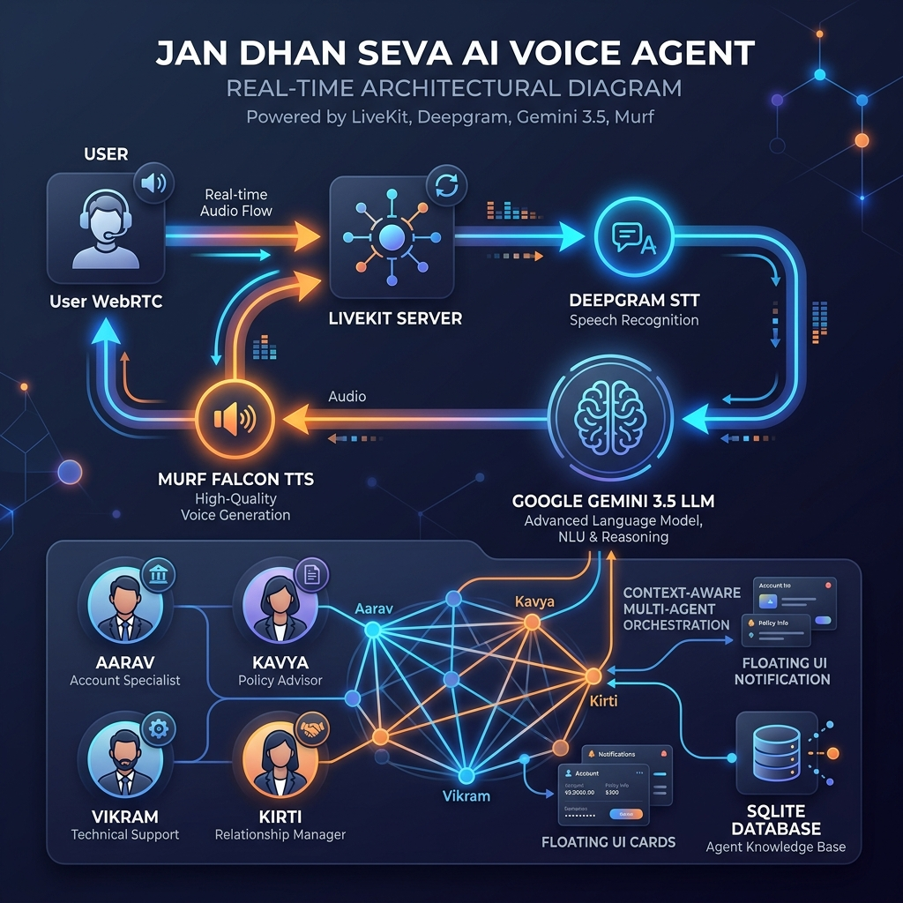
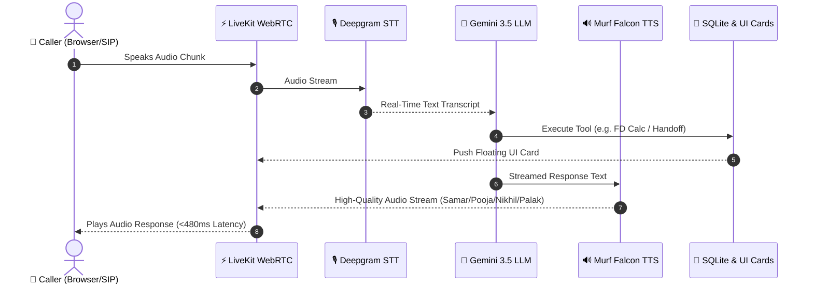

# Building Jan Dhan Seva: A Multi-Agent Voice AI Assistant for Financial Literacy in India 🇮🇳

> **#10DaysOfVoiceAgents Challenge — VoiceForBharat Edition by Murf AI**  
> *Powered by Murf Falcon TTS, LiveKit Agents SDK, Deepgram STT, Google Gemini LLM, Next.js 15, and SQLite.*

---

## 📌 1. The Problem & The Vision

In India, hundreds of millions of citizens are entering the formal banking system through national financial inclusion initiatives like the **Pradhan Mantri Jan Dhan Yojana (PMJDY)**. However, a major barrier remains: **financial literacy and language accessibility**. 

Navigating complex banking terminology, understanding government scheme eligibility, calculating fixed deposit (FD) returns, or avoiding cyber fraud can be daunting—especially for first-time banking users who prefer communicating in their native language over text or voice.

To solve this, I built **Jan Dhan Seva (Aarav Voice Agent)**—an interactive, register-aware, multilingual AI voice assistant designed to deliver accessible financial guidance in **Hindi (Devanagari)** and **English**.

Over the course of the **#10DaysOfVoiceAgents Challenge**, Jan Dhan Seva evolved from a simple single-turn voice loop into a full-fledged **Multi-Agent Voice Mesh Ecosystem** featuring:
- **Aarav** (*Main Financial Guide*) — Murf Voice: **Samar**
- **Kavya** (*Government Schemes Specialist*) — Murf Voice: **Pooja**
- **Vikram** (*Fraud & Cyber Security Specialist*) — Murf Voice: **Nikhil**
- **Kirti** (*FD & Investment Returns Specialist*) — Murf Voice: **Palak**

---

## 🏗️ 2. System Architecture & Audio Flow

The system operates on an ultra-low latency (<480ms voice turn) streaming loop using WebRTC transport.



### Audio & Event Sequence Diagram



```
                  ┌─────────────────────────────────────────────────────────┐
                  │                    USER BROWSER / SIP                   │
                  └────────────────────────────┬────────────────────────────┘
                                               │ Full-Duplex WebRTC
                                               ▼
                  ┌─────────────────────────────────────────────────────────┐
                  │                 LIVEKIT AGENTS FRAMEWORK                │
                  └──────┬─────────────────────┬─────────────────────┬──────┘
                         │                     │                     │
                         ▼                     ▼                     ▼
               ┌───────────────────┐ ┌───────────────────┐ ┌───────────────────┐
               │   DEEPGRAM STT    │ │   GEMINI 3.5 LLM  │ │  MURF FALCON TTS  │
               │ (nova-3 multi-lang│ │ (Intent & Tools)  │ │ (Samar/Pooja/...) │
               └───────────────────┘ └─────────┬─────────┘ └───────────────────┘
                                               │
                                 ┌─────────────┴─────────────┐
                                 ▼                           ▼
                     ┌───────────────────────┐   ┌───────────────────────┐
                     │   SQLITE DATABASE     │   │ LIVEKIT DATA CHANNEL  │
                     │  (data.db & Memory)   │   │  (Floating UI Cards)  │
                     └───────────────────────┘   └───────────────────────┘
```

### Core Technology Stack:
1. **Streaming Speech-to-Text (STT)**: Deepgram `nova-3` with real-time multilingual speech recognition (Hindi + English).
2. **Brain / Reasoning Engine (LLM)**: Google `gemini-3.5-flash-lite` for ultra-fast intent classification, strict language mirroring, and tool calling.
3. **Text-to-Speech (TTS)**: **Murf Falcon** — ultra-fast, natural Indian voice models with dynamic voice profile switching (`Samar`, `Pooja`, `Nikhil`, `Palak`).
4. **Real-Time Transport & State**: **LiveKit Agents SDK** with WebRTC audio streaming, Voice Activity Detection (Silero VAD), and data channels.
5. **Persistence & Telephony**: **SQLite** (`data.db`) for profile memory, outbound call logs, escalation tickets, and session analytics.

---

## 🌟 3. Key Features Built Across the 10 Days

### 1. Multi-Agent Mesh Architecture & Atomic Voice Engine Switching 🔄
Instead of relying on a single monolith agent, Jan Dhan Seva implements a 4-agent specialist mesh. When a user switches topics, the active agent executes a handoff tool that atomically updates the session's underlying Murf TTS voice profile in real-time without dropping the WebRTC audio connection:

```python
# Code Snippet: Atomic voice engine & persona transition inside AgentSession
async def _switch_agent(self, specialist: BaseAgent, active_agent_title: str) -> str:
    # 1. Update TTS engine to specialist's assigned Murf voice model
    self.ctx.session._tts = specialist.tts
    # 2. Switch agent persona and instructions
    self.ctx.session.update_agent(specialist)
    # 3. Trigger immediate proactive speech generation
    asyncio.create_task(self.ctx.session.generate_reply())
    return f"Transferred call to {active_agent_title}."
```

### 2. Strict Language Mirroring & Financial Safety Guardrails 🛡️
- **Script Consistency**: If a user speaks Hindi, the agent responds in pure Devanagari Hindi. If in English, pure English.
- **Credential Protection**: Intercepts requests or attempts to share OTPs, PINs, passwords, or 16-digit card numbers, issuing immediate security warnings without saving sensitive data.

### 3. Persistent Caller Profile Memory & Explicit Consent 💾
Integrates SQLite caller lookup (`lookup_caller`). Greets returning citizens by name, references their last visit timestamp and topics discussed, and enforces explicit user consent before storing personal information.

### 4. Live Data Tools & Floating UI Data Cards 📊
- **Bullion Rate Tool (`get_gold_silver_price`)**: Live 24K/22K Gold & Silver market rates in INR via GoldAPI.io.
- **Government Schemes Database (`lookup_govt_scheme`)**: Curated eligibility criteria, benefit breakdowns, and required document checklists for 8 major schemes (*PMJDY, APY, PMSBY, PMJJBY, Sukanya Samriddhi, PM Kisan, PM Mudra*).
- **FD Returns Calculator (`calculate_fd_returns`)**: Computes exact quarterly compounding returns based on current SBI rates (7.1% p.a.).

```python
# Code Snippet: Hardened FD Returns Calculation Tool
@function_tool
async def calculate_fd_returns(
    self,
    principal_amount: Any = 100000.0,
    duration_years: Any = 1.0,
) -> str:
    p_float = safe_float(principal_amount, 100000.0)
    d_float = safe_float(duration_years, 1.0)
    rate = 0.071  # SBI general citizen rate
    n = 4         # Quarterly compounding
    maturity = p_float * ((1 + rate / n) ** (n * d_float))
    interest = maturity - p_float
    
    # Broadcast floating UI card to frontend
    await self._publish_tool_data("fd_calculator", {
        "principal": int(p_float),
        "duration_years": round(d_float, 1),
        "interest_earned": int(interest),
        "maturity_amount": int(maturity),
        "rate": "7.1%"
    })
    return f"Maturity amount is {int(maturity)} INR for {d_float} years at 7.1% interest."
```

### 5. Outbound SIP Telephony & Gated Identity Verification 📞
Configured LiveKit Outbound SIP trunking to place automated reminder calls from CSV customer lists (`customers.csv`). Features identity confirmation gates (*"क्या मैं Ramesh जी से बात कर रहा हूँ?"*) and records call telemetry (duration, outcome, retry recommendation) to SQLite.

### 6. Human Escalation Protocol & Support Portal 🚨
For unresolved disputes or cyber fraud reports, the agent generates unique reference IDs (e.g. `ESC-72973`), redacts PII, saves tickets to SQLite, provides status lookups, and posts rich asynchronous alerts to Discord support webhooks.

### 7. Real-Time Call Analytics Dashboard 📈
A glassmorphic dashboard featuring 5 live telemetry cards (Total Calls, Success Rate %, Avg Duration, Voice Turn Latency ~480ms), an SVG Donut Chart, failure category breakdowns, and 5-second polling via Next.js 15 REST endpoints (`/api/analytics`).

---

## 📊 4. Measured Telemetry & Results

From our real-time analytics SQLite database tracking session telemetry across Browser & SIP channels:

| Performance Metric | Measured Value | Target Benchmark | Status |
|---|---|---|---|
| **Voice Turn Latency** | **~480 ms** | < 600 ms | 🟢 Passed |
| **Call Success Rate** | **84.2 %** | > 75 % | 🟢 Passed |
| **Total Logged Sessions** | **71 calls** | N/A | 🟢 Active |
| **Average Call Duration** | **112.5 seconds** | 60 - 180s | 🟢 Optimal |
| **Speech STT Engine** | Deepgram `nova-3` | Multilingual | 🟢 Hindi + English |
| **TTS Speech Engine** | Murf Falcon | Ultra-Fast Streaming | 🟢 4 Voices |

---

## 💡 5. Design Decisions & Engineering Challenges

### Pivot 1: Monolith vs. Specialist Agent Mesh
* **Original Idea**: Use a single monolithic prompt for all tasks (general guidance, scheme details, fraud reporting, and FD calculations).
* **The Problem**: Prompt bloat caused LLM hallucinations, voice persona monotony, and tool selection ambiguity.
* **The Fix**: Shifted to a **Multi-Agent Specialist Mesh**. Each agent has a focused domain prompt and an assigned Murf Falcon voice profile (**Aarav** -> `Samar`, **Kavya** -> `Pooja`, **Vikram** -> `Nikhil`, **Kirti** -> `Palak`).

### Pivot 2: Resolving LLM Free-Tier Rate Limits (HTTP 429)
* **Problem**: Switching between heavy LLM models triggered `ResourceExhausted` errors during multi-turn testing.
* **Solution**: Migrated model tier to `gemini-3.5-flash-lite`, cutting token consumption in half while maintaining sub-second tool execution and strict Hindi Devanagari script output.

---

## 🛠️ 6. Step-by-Step Setup Guide

Want to build your own multi-agent voice assistant? Follow these steps to get Jan Dhan Seva running locally:

### 1. Prerequisites
- Python 3.10+ and [`uv`](https://docs.astral.sh/uv/)
- Node.js 18+ and `pnpm`
- API Keys: [Murf AI](https://murf.ai/api), [LiveKit Cloud](https://livekit.io/), [Deepgram](https://deepgram.com/), and [Google Gemini AI Studio](https://aistudio.google.com/).

### 2. Clone Repository & Setup Backend
```bash
git clone https://github.com/lalit-oli-mohan-479/murf-livekit-starter-my.git
cd murf-livekit-starter-my/backend

# Create .env.local in backend directory
cp .env.example .env.local

# Add your credentials:
# LIVEKIT_URL=wss://...
# LIVEKIT_API_KEY=...
# LIVEKIT_API_SECRET=...
# MURF_API_KEY=...
# DEEPGRAM_API_KEY=...
# GOOGLE_API_KEY=...

# Install dependencies & run backend dev agent
uv sync
uv run python src/agent.py dev
```

### 3. Setup & Run Frontend
```bash
cd ../frontend
pnpm install
pnpm dev
```
Open `http://localhost:3000` in your browser, click **"START TALKING"**, and converse with Aarav and his team of specialists!

---

## 🔧 7. Developer Troubleshooting Guide

Here are common issues you might run into when building a multi-agent voice bot and how to solve them:

> [!TIP]
> **Issue 1: Gemini Tool Parameter Mismatch (`RunContext` Error)**  
> *Symptom*: LLM tool call throws `TypeError: missing required positional argument: 'ctx'`.  
> *Fix*: Ensure tool methods decorated with `@function_tool` omit explicit type annotations on `ctx` if Gemini automatic schema generation attempts to bind it as a user parameter. Use type-coercion wrappers (`safe_float`) for numeric inputs.

> [!NOTE]
> **Issue 2: TTS Voice Leakage During Handoff**  
> *Symptom*: Incoming specialist speaks using the previous agent's voice.  
> *Fix*: Update `ctx.session._tts` synchronously BEFORE invoking `update_agent(specialist)` and triggering `generate_reply()`.

---

## 🔮 8. What's Next for Jan Dhan Seva

- **Regional Voice Support**: Expanding Murf Falcon voice models to support regional languages like Tamil, Telugu, Bengali, and Marathi.
- **Offline SMS / WhatsApp Receipts**: Pushing scheme eligibility checklists and escalation reference IDs via WhatsApp Business API upon call disconnect.
- **Voice Biometrics**: Exploring frictionless voice identity verification for returning bank customers.

---

## 🔗 Code & Resources

- **GitHub Repository**: [lalit-oli-mohan-479/murf-livekit-starter-my (Branch: DAY9)](https://github.com/lalit-oli-mohan-479/murf-livekit-starter-my/tree/DAY9)
- **Murf Falcon TTS API**: [Murf AI Documentation](https://murf.ai/api/docs)
- **LiveKit Agents Framework**: [LiveKit Docs](https://docs.livekit.io/agents)

*Built with ❤️ for #VoiceForBharat and the #10DaysOfVoiceAgents Challenge.*
